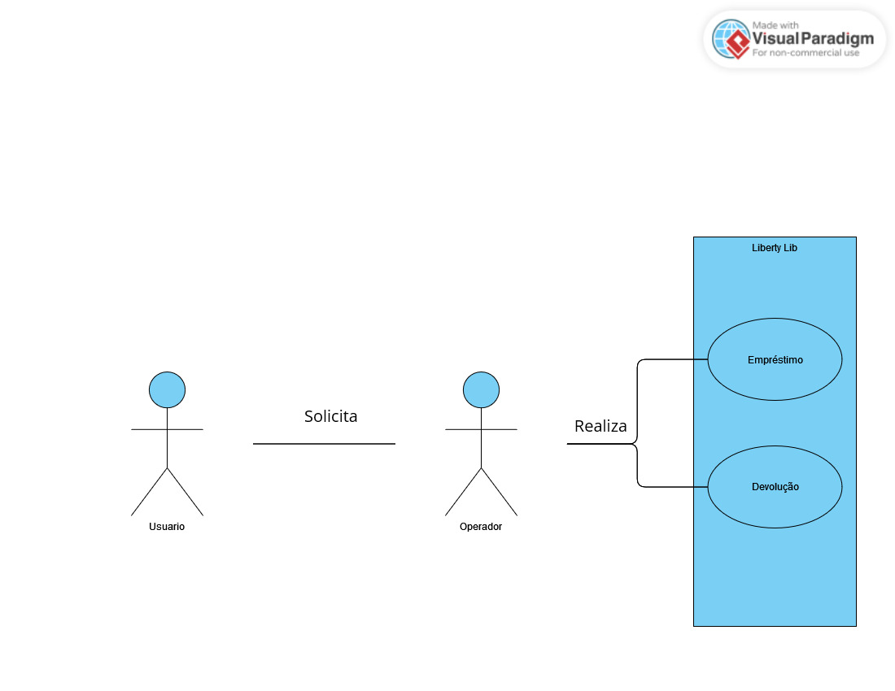

# Liberty Lib: Angular Library Management System

## 5 Results

In this section, the results of the development will be presented. The obtained results reflect the work carried out throughout the project, offering valuable insights into the functionality and performance of the developed system. 

The results demonstrate the effectiveness of open-source software for libraries, meeting the specific demands of library management efficiently and simplistically. The developed system allows for book registration and search, copy control, and loan management, offering a complete and comprehensive solution for library needs.

Moreover, the use of Java and Angular technologies provided a user-friendly and responsive interface, ensuring an enhanced user experience. The results also validate the use of microservices architecture, which allows for system scalability and modularity, facilitating maintenance and promoting flexibility for future updates.

The conducted tests confirm the stability and reliability of the software, ensuring its integrity and performance in different usage scenarios. The quality of the developed code, combined with good software development practices, resulted in a robust and secure system.

The obtained results are promising and open possibilities for future collaborations and contributions from the developer community. Open-source software for libraries presents itself as a modern and flexible solution, capable of improving library management processes and optimizing user experience.

### 5.1 Server

The structure adopted for the backend application follows a microservices architecture, where each functionality is divided into independent microservices. The request flow starts with the client, which makes a request to the Zuul API Gateway. The API Gateway acts as an intermediary between the client and the target microservices. It receives the request and forwards it to the appropriate microservice based on the defined configuration.

In this context, we have three main microservices: "Lib", "User," and "Auth." The "Lib" microservice is responsible for all operations related to the library, including CRUD operations with books and copies, as well as loan operations. The "User" microservice simulates library users, managing user information and authentication.

Each of these microservices has its own database, allowing for separation and isolation of specific data for each service. This promotes better modularity and scalability of the system.

Furthermore, all microservices act as clients of the Eureka server. The Eureka server plays an important role in service discovery, allowing microservices to register and locate each other dynamically. It acts as a Service Registry, where microservices can find information about other available microservices on the network.

This microservices structure and the use of the Zuul API Gateway and Eureka server bring benefits such as scalability, flexibility, and resilience to the application, allowing for the addition or removal of microservices as needed, as well as load balancing and fault recovery.

.png)

### 5.1.1 Lib Microservice

The "Lib" microservice is an essential part of the project's architecture and has a structured organization in various packages, each performing a specific role. Below, I will briefly describe each of these packages that have been developed:

- **com.lib.book:** This package follows the Spring Boot pattern for project structure, containing classes related to book management. Here, you can find database configurations, initialization classes, as well as controllers and route mappings related to the "Book" entity.

- **com.lib.config:** This package contains configurations related to RestTemplate, which is a Spring Framework class used to make calls to external REST APIs. Here, authentication configurations, interceptors, and other relevant configurations for requests can be found.

- **com.book.DTO:** In this package, the Data Transfer Objects (DTOs) are located, which are classes responsible for defining the structure of data transferred between different layers of the application. DTOs can be used to avoid sensitive information leakage, provide a customized view of data, or group multiple entities into a single response.

- **com.book.entities:** Here are the entities of the "Lib" microservice. These entities represent the domain objects mapped in the database. In this case, the entities include "Book" (Book), "BookCopy" (Book Copy), "Loan" (Loan), "Users" (Users), and "Notices" (Notices). It is worth mentioning that the "Users" entity is not mapped by JPA, as it is an entity used as a RestTemplate to fetch user information from another microservice.

- **com.book.feignclients:** This package contains the "UserFeignClient," which is an interface used to make calls to the "User" microservice. Feign is a Spring Cloud library that simplifies communication between microservices through a declarative approach.

- **com.book.repositories:** In this package, the repository interfaces are located, defining the data persistence operations related to each entity. These interfaces are responsible for interacting with the database, providing methods for creating, reading, updating, and deleting records.

- **com.book.resources:** Here are the application endpoints, which are the classes responsible for receiving HTTP requests and forwarding them to the appropriate layers. The endpoints related to the "Book," "BookCopy," "Loan," and "Notices" entities are implemented in this package.

- **com.book.services:** This package contains the service classes, responsible for implementing the business logic of the "Lib" microservice. Here, you will find the "BookService," "BookCopyService," "LoanService," and "NoticesService" classes, which perform operations related to each of these entities.

This package structure provides a clear and modular organization of the "Lib" microservice, facilitating code understanding and maintenance, as well as promoting proper separation of responsibilities. Each package has a specific purpose and contributes to the overall operation and success of the application.

### 5.1.2 User Microservice

The "User" microservice plays a specific role in the project context, providing resources related to the system's users. Although not essential for the "Lib" operation, the "User" microservice can be integrated flexibly into an existing environment that already has its user management system, such as in the example of a school with an existing student and teacher system.

Below, I will briefly describe the packages that make up the structure of the "User" microservice:

- **com.user.entities:** This package follows the Spring pattern and contains the configuration and initialization classes of the "User" microservice.

- **com.user:** In this package, the "User" entity is located, which represents the domain object related to users. This entity is mapped in the database and contains the necessary information to represent a user in the system.

- **com.user.repositories:** Here are the repository interfaces responsible for interacting with the database and performing persistence operations related to the user. Through the use of JPA (Java Persistence API), it is possible to perform queries, inserts, updates, and deletions of records in the user table.

- **com.user.service:** In this package, the service of the "User" microservice is located, responsible for implementing the business logic related to users. This layer abstracts the interaction with the repositories and provides methods for performing operations such as user registration, query, and update.

- **com.user.resource:** Here are located the endpoints of the "User" microservice API. These classes are responsible for receiving HTTP requests related to users and forwarding them to the appropriate service layers. The endpoints define the routes and HTTP methods (such as GET, POST, PUT, DELETE) that allow interaction with user resources.

The package structure of the "User" microservice allows for clear and modular organization, facilitating code development and maintenance. The "User" microservice can be flexibly integrated into the system, allowing the "Lib" to obtain user data from an external environment, such as an existing management system. This approach allows for greater adaptability and resource reuse, making the system more flexible and scalable.

### 5.1.3 Auth Microservice

*Content for Auth Microservice goes here.*

### 5.1.4 Eureka Server Microservice

*Content for Eureka Server Microservice goes here.*

### 5.1.5 Zuul Gateway Microservice

*Content for Zuul Gateway Microservice goes here.*

